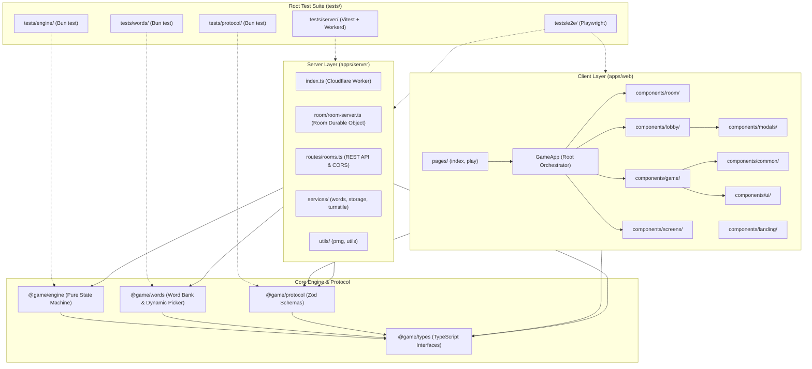

# undercover

> Real-time, zero-login social deduction word game for in-person groups and calls. Built with Astro, React, Cloudflare Workers, and PartyServer.

---

## 🕵️ The Game

**Undercover** is a party game of deduction, deception, and bluffing for 4–20 players.

- **👥 Civilian (Majority)**: Everyone receives the same secret word. Give subtle clues to spot who doesn't belong without revealing the exact word to Mr. White.
- **🎭 Undercover (Infiltrator)**: You receive a subtly different word (e.g. *Coffee* vs *Tea*). Blend in, deduce what the civilians have, and deflect suspicion.
- **👻 Mr. White (Ghost)**: You receive NO word at all! Listen closely, bluff your way through, or guess the civilian word when caught to steal the victory.

---

## 🛠️ Architecture Graph & System Map

The codebase is organized as a graph of isolated, single-responsibility layers:



---

## 🗺️ Codebase Directory Map

```
undercover/
├── apps/
│   ├── web/                     # Frontend (Astro 7 + React 19 + Tailwind v4 + shadcn)
│   │   └── src/
│   │       ├── components/
│   │       │   ├── landing/     # LandingHeader, LandingActions, RolesSection
│   │       │   ├── room/        # CreateFlow, JoinFlow, RoomCodeShare
│   │       │   ├── lobby/       # LobbyScreen, LobbySettings, PendingRequestsPanel, PlayerManageModal, SelfEditModal
│   │       │   ├── game/        # InGameScreen, GameCountdown, PlayerGrid, RoleCard, EliminationResultCard, GameOverScreen
│   │       │   ├── screens/     # WaitingScreen, PendingScreen, StatusNoticeScreen
│   │       │   ├── modals/      # AvatarPickerModal, RulesDialog, ProfileEditor
│   │       │   ├── common/      # Container, BrandLogo, AvatarTile
│   │       │   ├── ui/          # Button, Card, Dialog, Badge, Input (shadcn brutalist)
│   │       │   ├── GameApp.tsx  # Game island router & state coordinator
│   │       │   └── index.ts     # Central barrel re-export
│   │       ├── lib/             # WebSocket connection client, API helpers, DiceBear avatars, storage
│   │       ├── stores/          # Zustand game store
│   │       └── pages/           # Astro static pages (index.astro, play.astro)
│   │
│   └── server/                  # Cloudflare Workers + Durable Objects (PartyServer)
│       └── src/
│           ├── room/            # Room Durable Object class (state persistence, broadcast, alarms)
│           ├── routes/          # REST endpoints (POST /rooms, GET /rooms/:code, CORS)
│           ├── words.ts         # ServerWordBank service backed by @game/words
│           ├── storage.ts       # SQLite storage adapter
│           ├── turnstile.ts     # Turnstile verification
│           ├── prng.ts          # Seeded PRNG (Mulberry32)
│           ├── utils.ts         # Code generation, hashing, short IDs
│           └── index.ts         # Worker entrypoint
│
├── packages/
│   ├── engine/                  # Pure state machine (zero I/O, no globals)
│   │   └── src/
│   │       ├── rules/           # start, voting, elimination, win, mrwhite, phases, presence
│   │       ├── state/           # create-room, sanitize
│   │       ├── view/            # view-for (per-player view projection with zero role/word leaks)
│   │       └── index.ts         # Public API
│   │
│   ├── protocol/                # Zod validation schemas for all messages & views
│   │   └── src/                 # ClientMessage, ServerMessage, RoomView schemas
│   │
│   ├── types/                   # Shared TypeScript models and enums
│   │
│   └── words/                   # Word bank & 50/50 assignment picker
│       └── src/
│           ├── data/            # easy.ts, medium.ts, hard.ts, fan_fav.ts, words.ts
│           ├── constants/       # 12 Categories
│           └── helpers/         # getWordPair (50/50 random civilian/undercover coin flip)
│
└── tests/                       # Dedicated Monorepo Test Suites
    ├── engine/                  # 130 engine rules, voting, presence, simulation tests
    ├── protocol/                # 31 Zod message & security validation tests
    ├── words/                   # Word bank data integrity, category counts & 50/50 distribution tests
    ├── server/                  # 13 Cloudflare workerd integration tests (Vitest)
    └── e2e/                     # 5 Multi-player lifecycle tests (Playwright)
```

---

## 🔍 Quick Lookup Guide

| What are you looking for? | Where is it located? |
| :--- | :--- |
| **Game Rules & State Transitions** | `packages/engine/src/rules/` |
| **Voting & Elimination Logic** | `packages/engine/src/rules/voting.ts`, `elimination.ts` |
| **Mr. White Guess Evaluation & Normalization** | `packages/engine/src/rules/mrwhite.ts` |
| **Win Conditions (Civilians vs Infiltrators)** | `packages/engine/src/rules/win.ts` |
| **Player View Projection & Anti-Cheat Sanitization** | `packages/engine/src/view/view-for.ts` |
| **Word Datasets & Categories** | `packages/words/src/data/`, `packages/words/src/constants/` |
| **50/50 Random Word Assignment & Picker** | `packages/words/src/helpers/picker.ts`, `apps/server/src/words.ts` |
| **Realtime Room Durable Object** | `apps/server/src/room/room-server.ts` |
| **REST Endpoints (`/rooms`)** | `apps/server/src/routes/rooms.ts` |
| **Lobby UI & Host Rules Drawer** | `apps/web/src/components/lobby/` |
| **In-Game Voting Grid & Timers** | `apps/web/src/components/game/` |
| **Modals (Avatar Picker, Rules, Profile)** | `apps/web/src/components/modals/` |
| **UI Primitives (Neo-brutalist buttons, cards)** | `apps/web/src/components/ui/` |

---

## 🚀 Getting Started

### Prerequisites

- [Bun](https://bun.sh) (v1.3+)
- Node.js (v22+ LTS)

### Installation

```bash
bun install
```

### Local Development

Start both the Cloudflare Worker game server and the Astro web app concurrently:

```bash
bun run dev
```

- Web App: `http://localhost:4321`
- Game Server: `http://127.0.0.1:8787`

---

## 🧪 Testing

All test suites live in the dedicated root `tests/` directory:

```bash
# Run unit & simulation tests (engine, protocol, words)
bun run test

# Run Cloudflare Workers integration tests in workerd (server)
bun run test:server

# Run Playwright end-to-end tests across browsers (e2e)
bun run test:e2e

# Run all test suites
bun run test:all
```

---

## 🛡️ Boundary Check & Typecheck

```bash
# Verify strict monorepo boundary (apps/web must not import @game/words)
bun run check:boundaries

# Typecheck all packages and applications
bun run typecheck

# Production build
bun run build
```

---

## 📄 License

MIT © [aarabii](https://github.com/aarabii)
