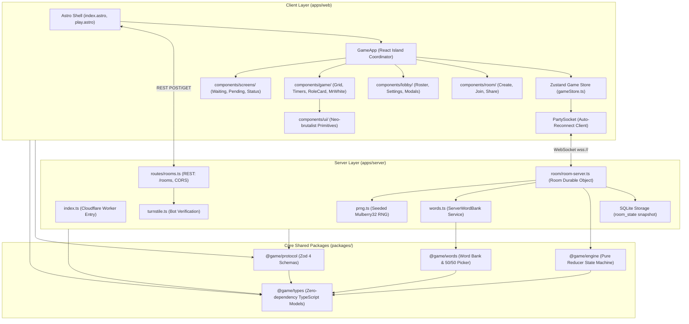
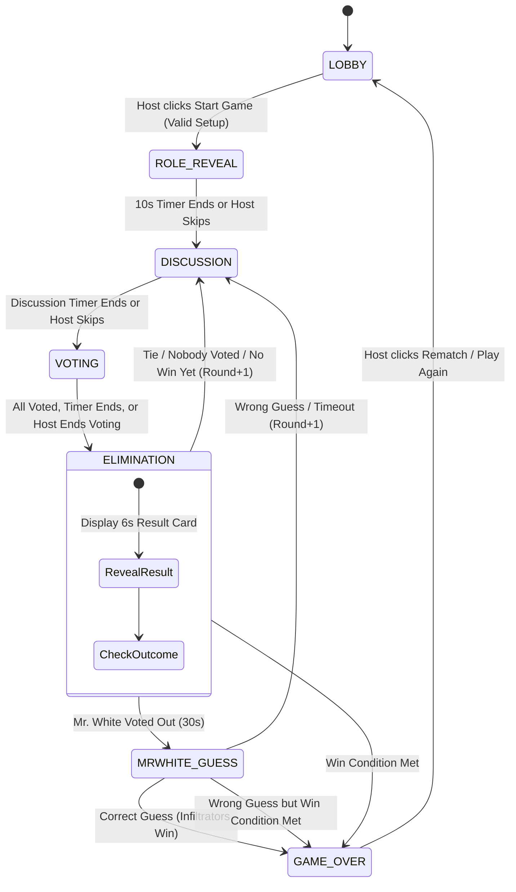

# Undercover

Real-time, zero-login, in-person social deduction word game for 4–20 players. Built with Astro, React, Cloudflare Workers, and PartyServer Durable Objects.

[](https://bun.sh)
[](https://astro.build)
[](https://react.dev)
[](https://workers.cloudflare.com)
[](https://opensource.org/licenses/MIT)

---

## The Game

**Undercover** is a party game of deduction, deception, and bluffing for 4–20 players.

### Roles & Objectives

| Role                           | Given Content                            | Objective                                                                                       |
| :----------------------------- | :--------------------------------------- | :---------------------------------------------------------------------------------------------- |
| **Civilian** _(majority)_      | The civilian secret word (e.g. _Coffee_) | Give subtle clues to expose infiltrators without tipping off Mr. White to the exact word.       |
| **Undercover** _(infiltrator)_ | A closely related word (e.g. _Tea_)      | Blend in, deduce the civilian word, and survive until infiltrators reach parity with civilians. |
| **Mr. White** _(infiltrator)_  | No word at all (blank card)              | Bluff through the rounds and guess the civilian word if voted out.                              |

> [!NOTE]
> Civilians and Undercovers both just see a word on their screen — neither knows their own role for certain. That doubt is the core tension of the game.

### In-Person Referee Concept

Undercover is designed for in-person groups and voice calls, not in-app chat:

- **Players speak out loud** — there's no clue-entry text box or chat feed.
- **The app is the impartial referee** — it manages rooms, distributes words, runs timers, tallies anonymous votes, and enforces win conditions.
- **Zero sound or vibration** — no tells that could give away a player's role to neighbors in a shared room.
- **Privacy card auto-hide** — the secret word card closes automatically when a player switches tabs or locks their phone.

### Win Conditions

Evaluated after every elimination (vote, disconnection, voluntary leave, or kick):

|         Alive Civilians          | Alive Infiltrators | Outcome                                                     |
| :------------------------------: | :----------------: | :---------------------------------------------------------- |
|               Any                |         0          | Civilians win — all infiltrators eliminated.                |
|               Any                |    ≥ Civilians     | Infiltrators win — parity reached.                          |
| More civilians than infiltrators |        ≥ 1         | Game continues to the next discussion round.                |
|                —                 |         —          | Mr. White guesses correctly → infiltrators win immediately. |

Vote ties (or nobody voting) mean nobody is eliminated. Eliminated players' identities are always revealed.

---

## Architecture & Monorepo Map

### System Architecture



### Monorepo Directory Structure

```
undercover/
├── apps/
│   ├── web/                          # Astro 7 + React 19 client island
│   │   ├── src/
│   │   │   ├── components/           # room/, lobby/, game/, screens/, ui/, GameApp.tsx
│   │   │   ├── lib/                  # REST API helpers, avatar renderer, storage
│   │   │   ├── pages/                # index.astro (landing/SEO), play.astro (SPA shell)
│   │   │   ├── stores/               # gameStore.ts (Zustand reactive game state)
│   │   │   └── styles/               # global.css (Tailwind v4 design tokens)
│   │   ├── astro.config.mjs
│   │   ├── vercel.json               # /r/:code rewrite to /play, CSP & headers
│   │   └── package.json
│   │
│   └── server/                       # Cloudflare Workers + PartyServer Durable Objects
│       ├── src/
│       │   ├── room/                 # room-server.ts (Room Durable Object with SQLite)
│       │   ├── routes/               # rooms.ts (POST /rooms, GET /rooms/:code, CORS)
│       │   ├── index.ts              # Worker fetch handler & PartyServer request router
│       │   ├── prng.ts               # Seeded Mulberry32 PRNG
│       │   ├── storage.ts            # SQLite state snapshot adapter
│       │   ├── turnstile.ts          # Cloudflare Turnstile validation
│       │   ├── utils.ts              # Room codes, token hashing, ID generators
│       │   └── words.ts              # ServerWordBank service
│       ├── wrangler.jsonc
│       └── package.json
│
├── packages/
│   ├── engine/                       # Pure game state machine (zero I/O, deterministic)
│   │   └── src/                      # rules/, state/, view/, reduce.ts
│   ├── protocol/                     # Zod 4 schemas for messages, models, and views
│   ├── types/                        # TypeScript types, enums, models, views
│   └── words/                        # Curated word pairs (server only, never sent to web)
│
├── tests/                            # e2e/, engine/, protocol/, server/, words/
├── scripts/
│   └── check-boundaries.ts           # Verifies web never imports @game/words
├── package.json                      # Monorepo workspaces and root scripts
└── tsconfig.base.json
```

### Package Dependency Boundaries

- **`packages/words` is strictly server-only.** Word lists and pairings are never imported into `apps/web`; clients only ever receive their single assigned word.
- **`bun run check:boundaries`** scans client code to guarantee no accidental `@game/words` imports.
- **`packages/engine` is zero I/O.** No `Date.now()`, `Math.random()`, or network/database calls — timestamps, PRNGs, IDs, and the word bank are injected via `EngineContext`.

---

## Core Game Engine & State Machine

### Pure Reducer Design

```ts
reduce(
  state: Room,
  action: ReducerAction,
  ctx: EngineContext // { now: number, rng: () => number, words: WordBank, newId: () => string }
): {
  state: Room;
  error?: string;
  effects: EngineEffect[];
  alarmAt: number | null;
}
```

The server hydrates state from SQLite, passes the incoming action into `reduce()`, saves the result, runs any side effects, and schedules the next deadline via the Durable Object alarm system (`alarmAt`).

### Phase State Machine



### Timer Configuration

All timers use absolute server timestamps (`endsAt`); clients render the countdown against `serverNow`.

| Phase / Event          | Default Duration | Host Configurable  |
| :--------------------- | :--------------: | :----------------: |
| Role Reveal            |       10 s       |         No         |
| Discussion             |     3:00 min     | Yes (0:30 – 10:00) |
| Voting                 |     1:00 min     | Yes (0:20 – 3:00)  |
| Elimination Screen     |       6 s        |         No         |
| Mr. White Guess        |       30 s       | Yes (0:15 – 1:00)  |
| Lobby Disconnect Grace |       15 s       |         No         |
| Host Migration Delay   |       15 s       |         No         |
| Idle Room Cleanup      |      30 min      |         No         |

### Mr. White Final Guess Normalization

When Mr. White is eliminated, the server checks their guess against the civilian word through a forgiving pipeline: lowercase/trim/strip-diacritics → strip punctuation and leading articles → normalize simple plurals → check curated aliases (`accept[]`) → allow Levenshtein distance ≤ 1 for words of 5+ characters.

---

## Security, Anti-Cheat & Privacy

- **Server-authoritative state** — clients send intents only; the server determines validity and projects a sanitized, per-player `RoomView` (`viewFor`). Opponents' words, unrevealed roles, and pending votes are never sent to the client.
- **Vote privacy** — only participation counts (e.g. `5/8 voted`) are broadcast during voting; identities stay hidden until tally.
- **Hidden roles by default** — Civilians and Undercovers get identical `WORD_ONLY` card views with no role metadata.
- **Tab-blur protection** — secret word cards auto-hide on `visibilitychange`/`blur`.
- **Bot & abuse mitigation** — Cloudflare Turnstile on room creation, rate limiting (10 requests/min/IP), 2 KB WebSocket message cap with strict Zod validation, ambiguity-free room codes (no `0`, `O`, `1`, `I`), and SHA-256-hashed reconnect tokens.

---

## Design System

Neo-brutalist, case-file aesthetic: flat shadows (no blur/gradients), hard 2–4px ink borders, a physical `2px, 2px` button-press translation, and one loud focal point per screen. Status is always dual-coded (e.g. eliminated players get grayscale _and_ a skull stamp, not just a color change) so nothing depends on color alone.

Fonts: `Archivo Black` for display headings, `Inter` for UI, `IBM Plex Mono` for timers and tabular figures. Motion stays under 250 ms and fully respects `prefers-reduced-motion`.

Tokens live in `apps/web/src/styles/global.css` (Tailwind v4 `@theme`) — role colors (lime for Civilian, sky for Undercover, a dashed white card for Mr. White), a warm off-white canvas, and a red accent for danger actions and low-time countdowns.

---

## Real-Time Protocol & Messages

Messages are typed in `@game/types` and validated with Zod 4 schemas in `@game/protocol`.

### Client Messages

| Message Type                    | Allowed Phase                           | Description                                               |
| :------------------------------ | :-------------------------------------- | :-------------------------------------------------------- |
| `hello`                         | Any                                     | Handshake for joining or reconnecting with a saved token. |
| `profile.update`                | `LOBBY`, waiting, pending               | Updates nickname or avatar.                               |
| `vote.cast`                     | `VOTING`                                | Casts or updates a vote.                                  |
| `mrwhite.guess`                 | `MRWHITE_GUESS`                         | Submits Mr. White's word guess.                           |
| `leave`                         | Any                                     | Leaves the room (instant elimination if in-game).         |
| `host.settings.update`          | `LOBBY`                                 | Updates room settings.                                    |
| `host.approve` / `host.decline` | Any                                     | Approves or declines a join request.                      |
| `host.kick`                     | Any                                     | Kicks a player and bans their token.                      |
| `host.lock`                     | Any                                     | Locks the room against new joins.                         |
| `host.transfer`                 | Any                                     | Transfers host privileges.                                |
| `host.start`                    | `LOBBY`                                 | Validates config and starts the game.                     |
| `host.pause` / `host.resume`    | `DISCUSSION`, `VOTING`, `MRWHITE_GUESS` | Freezes/unfreezes the timer.                              |
| `host.skip`                     | `ROLE_REVEAL`, `DISCUSSION`             | Advances to the next phase early.                         |
| `host.endVoting`                | `VOTING`                                | Closes voting immediately.                                |
| `host.endGame`                  | In-game                                 | Aborts the game, returns to lobby.                        |
| `host.playAgain`                | `GAME_OVER`                             | Resets to lobby for a rematch.                            |

### Server Messages

| Message Type | Description                               |
| :----------- | :---------------------------------------- |
| `state`      | Individualized `RoomView` snapshot.       |
| `error`      | Structured error code + message.          |
| `declined`   | Join request rejected.                    |
| `kicked`     | Player kicked and banned.                 |
| `replaced`   | Same reconnect token opened in a new tab. |
| `roomClosed` | Room expired or was terminated.           |

### Session Lifecycle & Reconnection

PartySocket auto-reconnects with exponential backoff and probes immediately on tab foreground. Lobby disconnects are held for 15 s; in-game disconnects are marked `away` and keep their seat until the round's vote concludes. If the host disconnects, host authority transfers to the earliest-joined connected player after 15 s.

---

## Word Bank & Randomness Engine

- **260 curated pairs** across 12 categories (Food & Drinks, Animals, Everyday Objects, Places & Travel, Pop Culture, Nature, Science & Tech, Sports, Fashion, Jobs, Body & Health, Fantasy & Mystery).
- **4 difficulty tiers**: `easy` (70), `medium` (70), `hard` (70), `fan_fav` (50, pulled from medium/hard).
- **50/50 coin-flip assignment** of Civilian vs. Undercover word per round, preventing pattern recognition across replays.
- **Seeded Mulberry32 PRNG** for deterministic, reproducible shuffles and test coverage.

---

## Getting Started

### Prerequisites

- [Bun](https://bun.sh) v1.3+
- [Node.js](https://nodejs.org) v22 LTS+
- Git

### Installation & Environment

```bash
git clone https://github.com/aarabii/undercover.git
cd undercover
bun install
```

Client (`apps/web/.env`):

```env
PUBLIC_WS_HOST=localhost:8787
PUBLIC_SITE_URL=http://localhost:4321
PUBLIC_TURNSTILE_SITEKEY=1x00000000000000000000AA # Cloudflare always-pass test key
```

Server (`apps/server/.dev.vars`):

```env
ALLOWED_ORIGINS=http://localhost:4321,https://undercover.aarab.me
TURNSTILE_SECRET=1x0000000000000000000000000000000AA # Cloudflare test secret
```

### Running Locally

```bash
bun run dev
```

- Web: `http://localhost:4321`
- Game server & WebSocket: `http://127.0.0.1:8787`

---

## Testing & Verification

```bash
bun run test          # Unit & simulation tests (engine, protocol, words)
bun run test:server    # Cloudflare Workers integration tests (workerd + SQLite)
bun run test:e2e       # Playwright multi-player end-to-end tests
bun run test:all       # All suites in sequence
bun run check:boundaries  # Verify web never imports @game/words
bun run typecheck      # TypeScript checks across all workspaces
bun run build          # Astro production build
```

---

## Deployment

**Server (Cloudflare Workers + Durable Objects):**

```bash
bunx wrangler deploy
bunx wrangler secret put TURNSTILE_SECRET
```

Requires DNS on Cloudflare; custom domain route configured at `ws.aarab.me`.

**Web client (Vercel):**

- Root directory: `apps/web` · Build: `astro build` · Output: `dist`
- Env vars: `PUBLIC_WS_HOST=ws.aarab.me`, `PUBLIC_TURNSTILE_SITEKEY=<production sitekey>`
- `vercel.json` rewrites `/r/:code` to `/play` for clean, shareable room links.

---

## License

Distributed under the **MIT License**. See [`LICENSE`](./LICENSE) for details.

Developed with care by [aarabii](https://github.com/aarabii).
